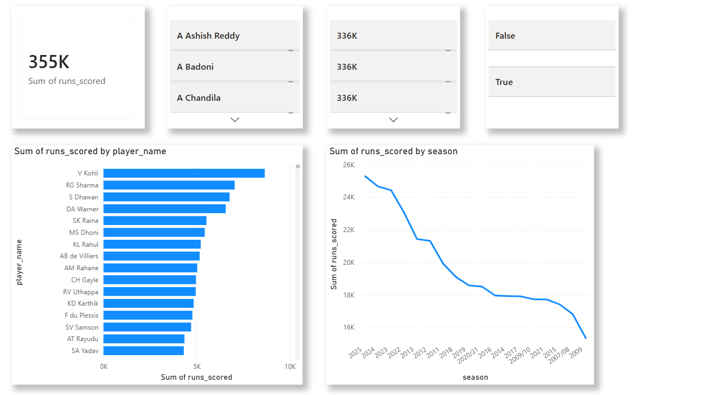

#  IPL Cricket Analytics Data Warehouse

> End-to-end data engineering project: From 278K+ ball deliveries to interactive dashboard



##  Project Overview

Built a production-grade **dimensional data warehouse** analyzing **Indian Premier League (IPL)** cricket data from 2008-2023, processing 278,205 ball-by-ball records across 1,169 matches.

### Key Achievements
-  Designed **star schema** with 7 dimensions + 3 fact tables at different grains
-  Created **6 analytical marts** for advanced cricket metrics
-  Built **interactive Power BI dashboards** with 15+ visualizations
-  Automated **ETL pipeline** processing in under 3 minutes

---

## Architecture
```
CSV Data (278K rows)
    ↓
Python ETL Pipeline
    ↓
PostgreSQL Star Schema
    ├─ 7 Dimension Tables
    ├─ 3 Fact Tables (ball/innings/match grain)
    └─ 6 Analytical Marts
    ↓
Power BI Dashboard
```

---

##  Data Model

### Star Schema Design

**Dimensions:**
- `dim_player` (768 players)
- `dim_team` (20 teams)
- `dim_venue` (63 stadiums)
- `dim_date` (885 dates)
- `dim_match` (1,169 matches)
- `dim_event` (18 tournaments)
- `dim_umpire` (47 umpires)

**Facts:**
- `fact_ball_delivery` - Granular (278K rows, ball-by-ball)
- `fact_innings_summary` - Aggregate (2,300+ rows)
- `fact_match_summary` - Aggregate (1,169 rows)

**Analytical Marts:**
1. `mart_death_over_specialists` - Overs 16-20 performance
2. `mart_powerplay_performers` - Overs 1-6 analysis
3. `mart_pressure_performance` - Clutch situations
4. `mart_partnership_analysis` - Batting partnerships
5. `mart_venue_analytics` - Stadium characteristics
6. `mart_player_stats` - Comprehensive player metrics


---

##  Tech Stack

| Layer | Technology |
|-------|------------|
| **Database** | PostgreSQL 15 |
| **ETL** | Python (pandas, SQLAlchemy) |
| **Orchestration** | Custom Python pipeline |
| **Data Modeling** | Kimball Star Schema |
| **Visualization** | Power BI Desktop |
| **Version Control** | Git & GitHub |

---

##  Dashboards & Insights

### Dashboard: Executive Overview
- Total runs scored across IPL history
- Top run scorers
- Season-wise trends

---

## Sample Insights

**Finding 1: Death Over Specialists**
```sql
-- Top 5 death over batsmen (Strike Rate > 150 in overs 16-20)
SELECT player_name, death_strike_rate, death_runs_scored
FROM mart_death_over_specialists
WHERE death_balls_faced >= 50
ORDER BY batting_impact_score DESC
LIMIT 5;
```

**Finding 2: Venue Characteristics**
- Wankhede Stadium: Batting paradise (avg 180+ runs)
- Chepauk: Bowler friendly (avg 155 runs)
- Toss advantage: 58% correlation with wins at certain venues

**Finding 3: Powerplay Impact**
- Teams scoring 50+ in powerplay win 73% of matches
- Dot ball % in powerplay correlates strongly with match outcomes


## Project Structure
```
ipl-data-warehouse/
├── config/
│   └── database.py          # Database configuration
├── etl/
│   ├── extract.py           # CSV data extraction
│   ├── transform.py         # Data transformations
│   ├── load.py              # Load to warehouse
│   └── pipeline.py          # ETL orchestrator
├── sql/
│   ├── create_schema.sql    # Schema creation
│   ├── create_dimensions.sql
│   ├── create_facts.sql
│   └── create_marts.sql     # Analytical marts
├── scripts/
│   ├── setup_database.py    # Database initialization
│   ├── run_etl.py           # ETL runner
│   └── validate_data.py     # Data quality checks
├── dashboards/
│   └── IPL_Analytics_Dashboard.pbix
├── screenshots/             # Dashboard images
├── data/
│   ├── raw/                 # Source CSV files
│   └── logs/                # ETL logs
├── requirements.txt
├── .env.example
└── README.md
```

---


### Business Understanding
- Cricket analytics 
- Sports data modeling patterns
- Performance metrics (strike rate, economy, impact scores)

